# S-Bank System Architecture

## Overview
S-Bank is a decentralized savings platform built on Sui blockchain, featuring group rotating savings (Susu), personal piggy banks, reputation tracking, and NFT rewards.

## 🎨 High-Level System Architecture

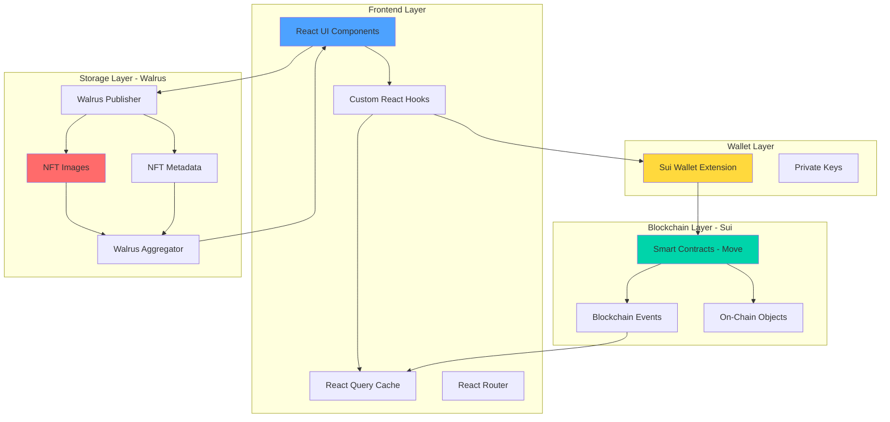
```mermaid
graph TB
    subgraph "Frontend Layer"
        UI[React UI Components]
        Hooks[Custom React Hooks]
        Query[React Query Cache]
        Router[React Router]
    end
    
    subgraph "Blockchain Layer - Sui"
        SC[Smart Contracts - Move]
        Events[Blockchain Events]
        Objects[On-Chain Objects]
    end
    
    subgraph "Storage Layer - Walrus"
        Images[NFT Images]
        Metadata[NFT Metadata]
        Aggregator[Walrus Aggregator]
        Publisher[Walrus Publisher]
    end
    
    subgraph "Wallet Layer"
        Wallet[Sui Wallet Extension]
        Keys[Private Keys]
    end
    
    UI --> Hooks
    Hooks --> Query
    Hooks --> Wallet
    Wallet --> SC
    SC --> Events
    SC --> Objects
    Events --> Query
    
    UI --> Publisher
    Publisher --> Images
    Publisher --> Metadata
    Aggregator --> UI
    Images --> Aggregator
    Metadata --> Aggregator
    
    style UI fill:#4DA2FF
    style SC fill:#00D4AA
    style Images fill:#FF6B6B
    style Wallet fill:#FFD93D
```

## Technology Stack

### Blockchain
- **Sui Blockchain**: Layer 1 blockchain for smart contracts
- **Move Language**: Smart contract programming language
- **Sui SDK**: `@mysten/sui` v1.45.0
- **Dapp Kit**: `@mysten/dapp-kit` v0.19.9

### Storage
- **Walrus**: Decentralized storage for NFT images and metadata
- **HTTP API**: Direct API calls to Walrus aggregator/publisher

### Frontend
- **React 18**: UI framework
- **TypeScript**: Type-safe development
- **Vite**: Build tool and dev server
- **TailwindCSS**: Styling framework
- **React Router**: Client-side routing
- **React Query**: Data fetching and caching

### State Management
- **TanStack Query (React Query)**: Server state management
- **React Hooks**: Local state management

## Smart Contract Architecture

### Module Structure

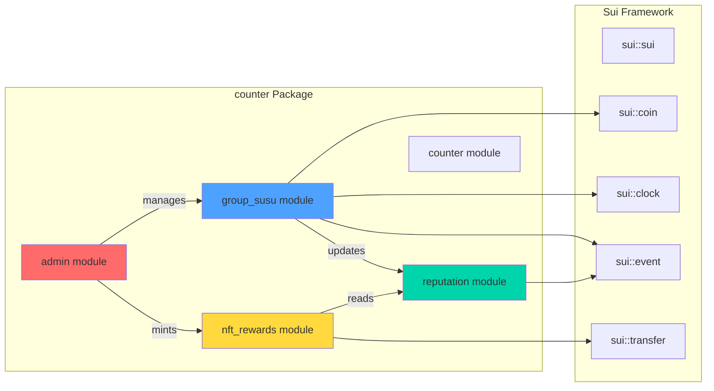
```mermaid
graph LR
    subgraph "counter Package"
        Admin[admin module]
        GroupSusu[group_susu module]
        NFTRewards[nft_rewards module]
        Reputation[reputation module]
        Counter[counter module]
    end
    
    subgraph "Sui Framework"
        SUI[sui::sui]
        Coin[sui::coin]
        Clock[sui::clock]
        Event[sui::event]
        Transfer[sui::transfer]
    end
    
    Admin --> |manages| GroupSusu
    Admin --> |mints| NFTRewards
    GroupSusu --> |updates| Reputation
    NFTRewards --> |reads| Reputation
    
    GroupSusu --> Coin
    GroupSusu --> Clock
    GroupSusu --> Event
    Reputation --> Event
    NFTRewards --> Transfer
    
    style Admin fill:#FF6B6B
    style GroupSusu fill:#4DA2FF
    style NFTRewards fill:#FFD93D
    style Reputation fill:#00D4AA
```

### Module Dependencies & Interactions

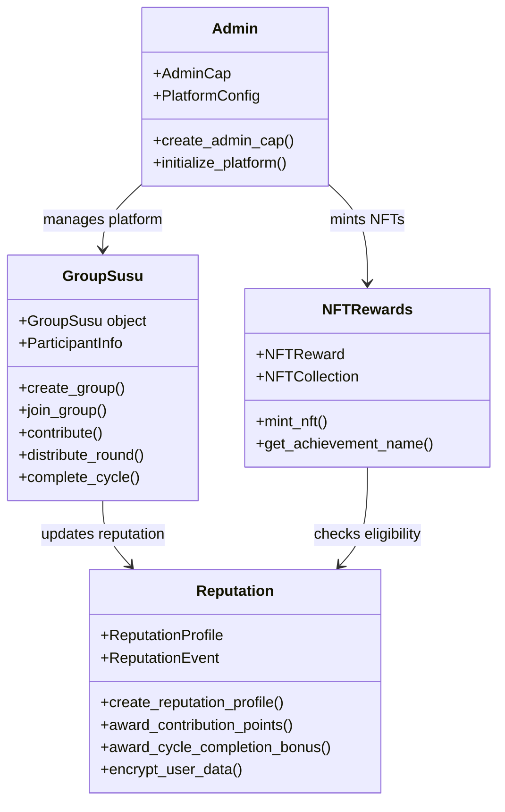
```mermaid
classDiagram
    class Admin {
        +AdminCap
        +PlatformConfig
        +create_admin_cap()
        +initialize_platform()
    }
    
    class GroupSusu {
        +GroupSusu object
        +ParticipantInfo
        +create_group()
        +join_group()
        +contribute()
        +distribute_round()
        +complete_cycle()
    }
    
    class Reputation {
        +ReputationProfile
        +ReputationEvent
        +create_reputation_profile()
        +award_contribution_points()
        +award_cycle_completion_bonus()
        +encrypt_user_data()
    }
    
    class NFTRewards {
        +NFTReward
        +NFTCollection
        +mint_nft()
        +get_achievement_name()
    }
    
    GroupSusu --> Reputation : updates reputation
    NFTRewards --> Reputation : checks eligibility
    Admin --> NFTRewards : mints NFTs
    Admin --> GroupSusu : manages platform
```

### Key Data Structures

#### GroupSusu
```move
public struct GroupSusu has key, store {
    id: UID,
    name: String,
    creator: address,
    contribution_amount: u64,
    contribution_frequency_ms: u64,
    max_participants: u64,
    participants: vector<address>,
    participant_count: u64,
    balance: u64,
    current_round: u64,
    total_rounds: u64,
    round_recipients: vector<address>,
    cycle_complete: bool,
    created_at: u64,
}
```

#### ReputationProfile
```move
public struct ReputationProfile has key, store {
    id: UID,
    owner: address,
    reputation_score: u64,
    cycles_completed: u64,
    total_contributions: u64,
    on_time_contributions: u64,
    late_contributions: u64,
    created_at: u64,
    encrypted_data: vector<u8>,
}
```

#### NFTReward
```move
public struct NFTReward has key, store {
    id: UID,
    name: String,
    description: String,
    image_url: String,        // Walrus blob ID
    metadata_url: String,     // Walrus blob ID
    achievement_type: u8,
    earned_at: u64,
    recipient: address,
}
```

## Frontend Architecture

### Directory Structure
```
src/
├── components/
│   ├── admin/          - Admin dashboard components
│   ├── dashboard/      - Dashboard widgets
│   ├── group/          - Group susu components
│   ├── layout/         - Layout components (Header, Sidebar, Footer)
│   ├── nft/            - NFT display components
│   ├── profile/        - Profile components
│   ├── reputation/     - Reputation display components
│   ├── transactions/   - Transaction components
│   └── ui/             - Reusable UI components
├── hooks/              - Custom React hooks
├── pages/              - Page components
├── services/           - External services (Walrus)
├── utils/              - Utility functions
├── constants.ts        - Environment constants
├── networkConfig.ts    - Network configuration
└── queryConfig.ts      - React Query configuration
```

### Key Hooks

#### Data Fetching Hooks
- `useAllGroups()` - Fetch all available groups
- `useUserGroups()` - Fetch user's joined groups
- `useGroupSusu()` - Fetch specific group details
- `useReputationProfile()` - Fetch user reputation
- `useUserNFTs()` - Fetch user's NFT collection
- `usePlatformStats()` - Fetch platform statistics
- `useAdminCap()` - Check admin capabilities

#### Transaction Hooks
- `useCreateReputationProfile()` - Create reputation profile
- Custom transaction builders in components

### Network Configuration
```typescript
{
  devnet: {
    url: getFullnodeUrl("devnet"),
    variables: { counterPackageId: DEVNET_COUNTER_PACKAGE_ID }
  },
  testnet: {
    url: getFullnodeUrl("testnet"),
    variables: { counterPackageId: TESTNET_COUNTER_PACKAGE_ID }
  },
  mainnet: {
    url: getFullnodeUrl("mainnet"),
    variables: { counterPackageId: MAINNET_COUNTER_PACKAGE_ID }
  }
}
```

## Data Flow

### 1. Group Susu Flow

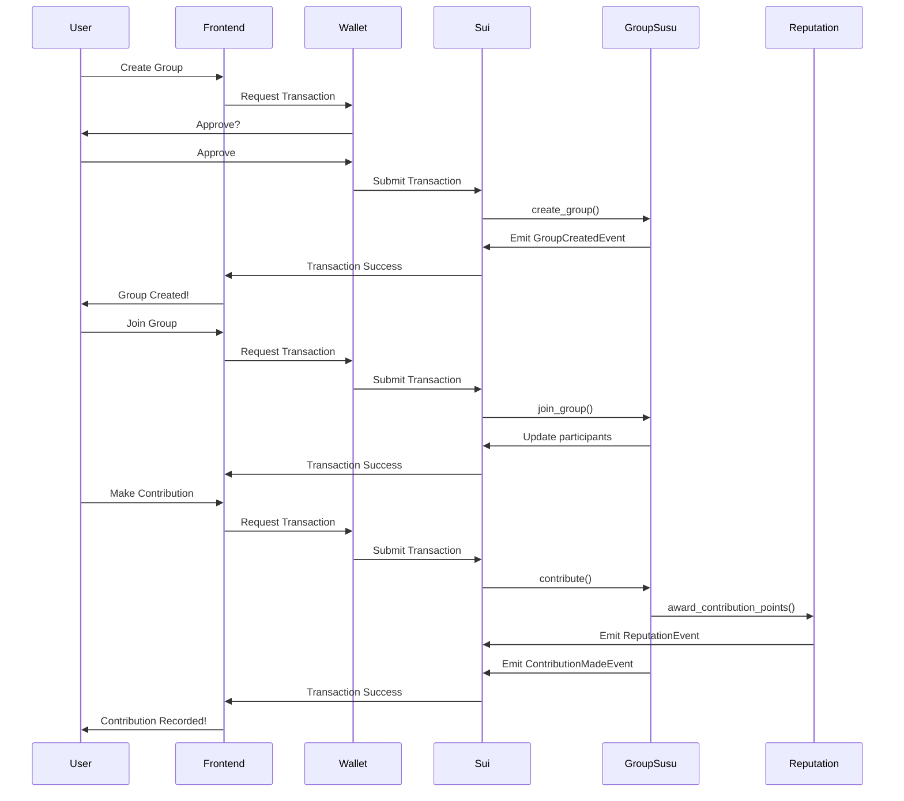
```mermaid
sequenceDiagram
    participant User
    participant Frontend
    participant Wallet
    participant Sui
    participant GroupSusu
    participant Reputation
    
    User->>Frontend: Create Group
    Frontend->>Wallet: Request Transaction
    Wallet->>User: Approve?
    User->>Wallet: Approve
    Wallet->>Sui: Submit Transaction
    Sui->>GroupSusu: create_group()
    GroupSusu->>Sui: Emit GroupCreatedEvent
    Sui->>Frontend: Transaction Success
    Frontend->>User: Group Created!
    
    User->>Frontend: Join Group
    Frontend->>Wallet: Request Transaction
    Wallet->>Sui: Submit Transaction
    Sui->>GroupSusu: join_group()
    GroupSusu->>Sui: Update participants
    Sui->>Frontend: Transaction Success
    
    User->>Frontend: Make Contribution
    Frontend->>Wallet: Request Transaction
    Wallet->>Sui: Submit Transaction
    Sui->>GroupSusu: contribute()
    GroupSusu->>Reputation: award_contribution_points()
    Reputation->>Sui: Emit ReputationEvent
    GroupSusu->>Sui: Emit ContributionMadeEvent
    Sui->>Frontend: Transaction Success
    Frontend->>User: Contribution Recorded!
```

### 2. Reputation Flow

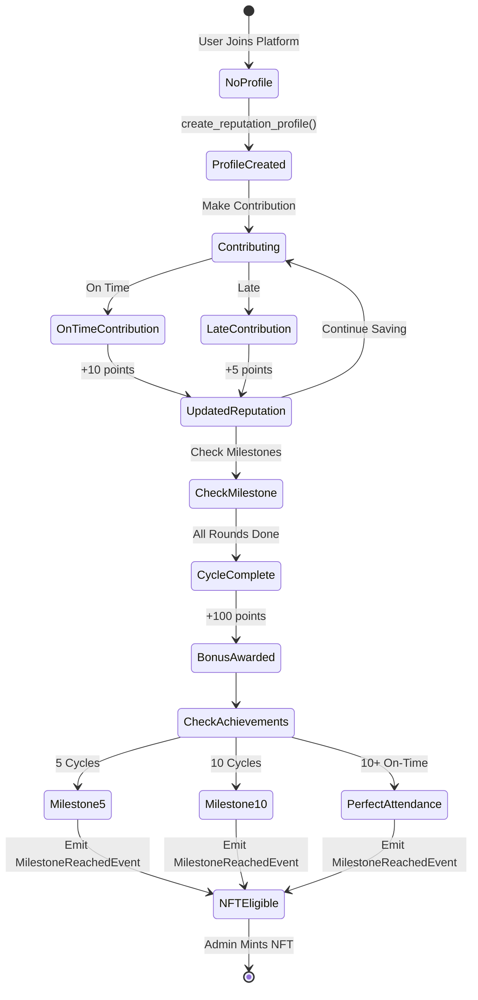
```mermaid
stateDiagram-v2
    [*] --> NoProfile: User Joins Platform
    NoProfile --> ProfileCreated: create_reputation_profile()
    
    ProfileCreated --> Contributing: Make Contribution
    Contributing --> OnTimeContribution: On Time
    Contributing --> LateContribution: Late
    
    OnTimeContribution --> UpdatedReputation: +10 points
    LateContribution --> UpdatedReputation: +5 points
    
    UpdatedReputation --> CheckMilestone: Check Milestones
    
    CheckMilestone --> CycleComplete: All Rounds Done
    CycleComplete --> BonusAwarded: +100 points
    BonusAwarded --> CheckAchievements
    
    CheckAchievements --> Milestone5: 5 Cycles
    CheckAchievements --> Milestone10: 10 Cycles
    CheckAchievements --> PerfectAttendance: 10+ On-Time
    
    Milestone5 --> NFTEligible: Emit MilestoneReachedEvent
    Milestone10 --> NFTEligible: Emit MilestoneReachedEvent
    PerfectAttendance --> NFTEligible: Emit MilestoneReachedEvent
    
    NFTEligible --> [*]: Admin Mints NFT
    
    UpdatedReputation --> Contributing: Continue Saving
```

### 3. NFT Reward Flow

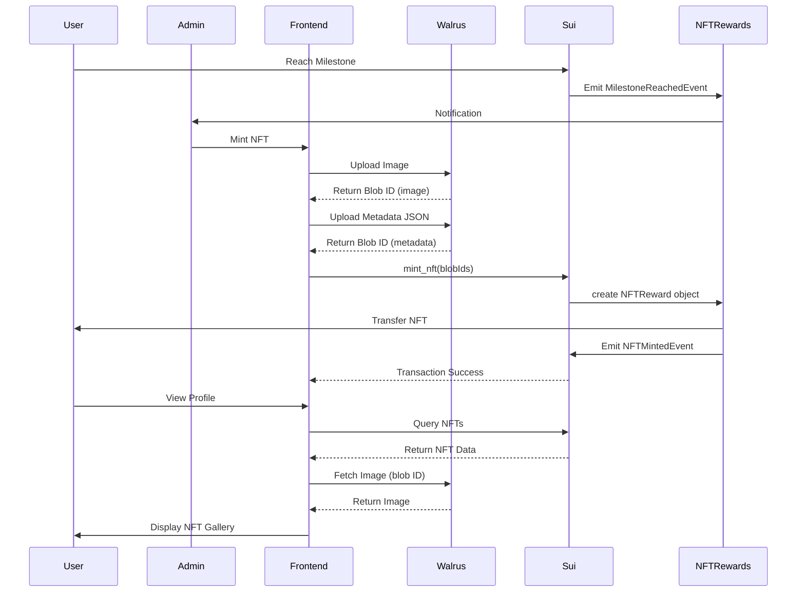
```mermaid
sequenceDiagram
    participant User
    participant Admin
    participant Frontend
    participant Walrus
    participant Sui
    participant NFTRewards
    
    User->>Sui: Reach Milestone
    Sui->>NFTRewards: Emit MilestoneReachedEvent
    NFTRewards->>Admin: Notification
    
    Admin->>Frontend: Mint NFT
    Frontend->>Walrus: Upload Image
    Walrus-->>Frontend: Return Blob ID (image)
    
    Frontend->>Walrus: Upload Metadata JSON
    Walrus-->>Frontend: Return Blob ID (metadata)
    
    Frontend->>Sui: mint_nft(blobIds)
    Sui->>NFTRewards: create NFTReward object
    NFTRewards->>User: Transfer NFT
    NFTRewards->>Sui: Emit NFTMintedEvent
    Sui-->>Frontend: Transaction Success
    
    User->>Frontend: View Profile
    Frontend->>Sui: Query NFTs
    Sui-->>Frontend: Return NFT Data
    Frontend->>Walrus: Fetch Image (blob ID)
    Walrus-->>Frontend: Return Image
    Frontend->>User: Display NFT Gallery
```

### 4. Piggy Bank Flow

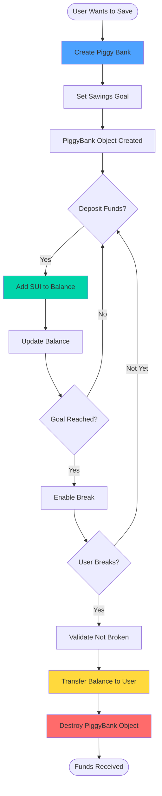
```mermaid
flowchart TD
    Start([User Wants to Save]) --> Create[Create Piggy Bank]
    Create --> SetGoal[Set Savings Goal]
    SetGoal --> PBCreated[PiggyBank Object Created]
    
    PBCreated --> Deposit{Deposit Funds?}
    Deposit -->|Yes| AddFunds[Add SUI to Balance]
    AddFunds --> UpdateBalance[Update Balance]
    UpdateBalance --> CheckGoal{Goal Reached?}
    
    CheckGoal -->|No| Deposit
    CheckGoal -->|Yes| CanBreak[Enable Break]
    
    CanBreak --> UserBreak{User Breaks?}
    UserBreak -->|Not Yet| Deposit
    UserBreak -->|Yes| ValidateBreak[Validate Not Broken]
    
    ValidateBreak --> Transfer[Transfer Balance to User]
    Transfer --> Destroy[Destroy PiggyBank Object]
    Destroy --> End([Funds Received])
    
    style Create fill:#4DA2FF
    style AddFunds fill:#00D4AA
    style Transfer fill:#FFD93D
    style Destroy fill:#FF6B6B
```

## Caching Strategy & Query Flow

### React Query Cache Architecture

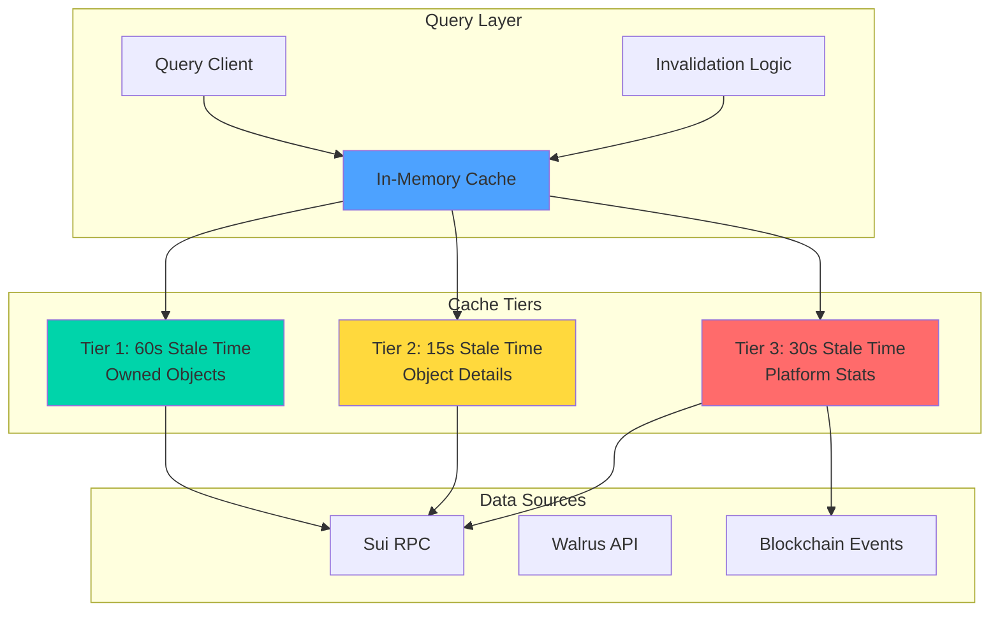
```mermaid
graph TB
    subgraph "Query Layer"
        QC[Query Client]
        Cache[In-Memory Cache]
        Invalidation[Invalidation Logic]
    end
    
    subgraph "Data Sources"
        Sui[Sui RPC]
        Walrus[Walrus API]
        Events[Blockchain Events]
    end
    
    subgraph "Cache Tiers"
        Tier1[Tier 1: 60s Stale Time<br/>Owned Objects]
        Tier2[Tier 2: 15s Stale Time<br/>Object Details]
        Tier3[Tier 3: 30s Stale Time<br/>Platform Stats]
    end
    
    QC --> Cache
    Cache --> Tier1
    Cache --> Tier2
    Cache --> Tier3
    
    Tier1 --> Sui
    Tier2 --> Sui
    Tier3 --> Sui
    Tier3 --> Events
    
    Invalidation --> Cache
    
    style Cache fill:#4DA2FF
    style Tier1 fill:#00D4AA
    style Tier2 fill:#FFD93D
    style Tier3 fill:#FF6B6B
```

### Cache Invalidation Flow

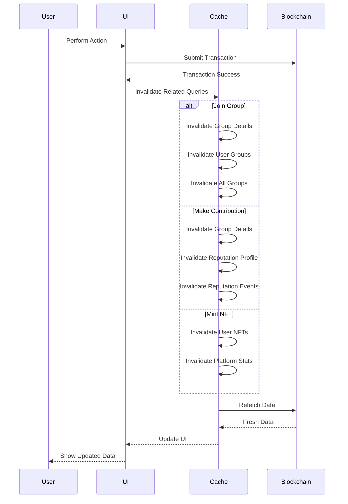
```mermaid
sequenceDiagram
    participant User
    participant UI
    participant Cache
    participant Blockchain
    
    User->>UI: Perform Action
    UI->>Blockchain: Submit Transaction
    Blockchain-->>UI: Transaction Success
    
    UI->>Cache: Invalidate Related Queries
    
    alt Join Group
        Cache->>Cache: Invalidate Group Details
        Cache->>Cache: Invalidate User Groups
        Cache->>Cache: Invalidate All Groups
    else Make Contribution
        Cache->>Cache: Invalidate Group Details
        Cache->>Cache: Invalidate Reputation Profile
        Cache->>Cache: Invalidate Reputation Events
    else Mint NFT
        Cache->>Cache: Invalidate User NFTs
        Cache->>Cache: Invalidate Platform Stats
    end
    
    Cache->>Blockchain: Refetch Data
    Blockchain-->>Cache: Fresh Data
    Cache-->>UI: Update UI
    UI-->>User: Show Updated Data
```

### Query Configuration
```typescript
// Tier 1: Owned objects (60s stale time)
- User's piggy banks
- User's groups  
- User's NFTs
- Admin capabilities

// Tier 2: Object details (15s stale time)
- Group details
- Reputation profile
- Piggy bank balance
- Group participants

// Tier 3: Platform stats (30s stale time)
- Total users
- Active groups
- NFTs minted
- Recent transactions
```

### Cache Invalidation Rules
```typescript
// After joining group
- Group details (specific group)
- User groups (user's list)
- All groups list (discovery)
- Platform stats (user count)

// After contribution
- Group details (balance, round)
- Reputation profile (points)
- Reputation events (history)
- User groups (status)

// After NFT mint
- User NFTs (recipient)
- Platform stats (NFT count)
- Reputation profile (achievements)

// After piggy bank action
- Piggy bank details (balance)
- User piggy banks (list)
- Platform stats (if relevant)
```

## Security Model & Validation Flows

### Authorization & Access Control

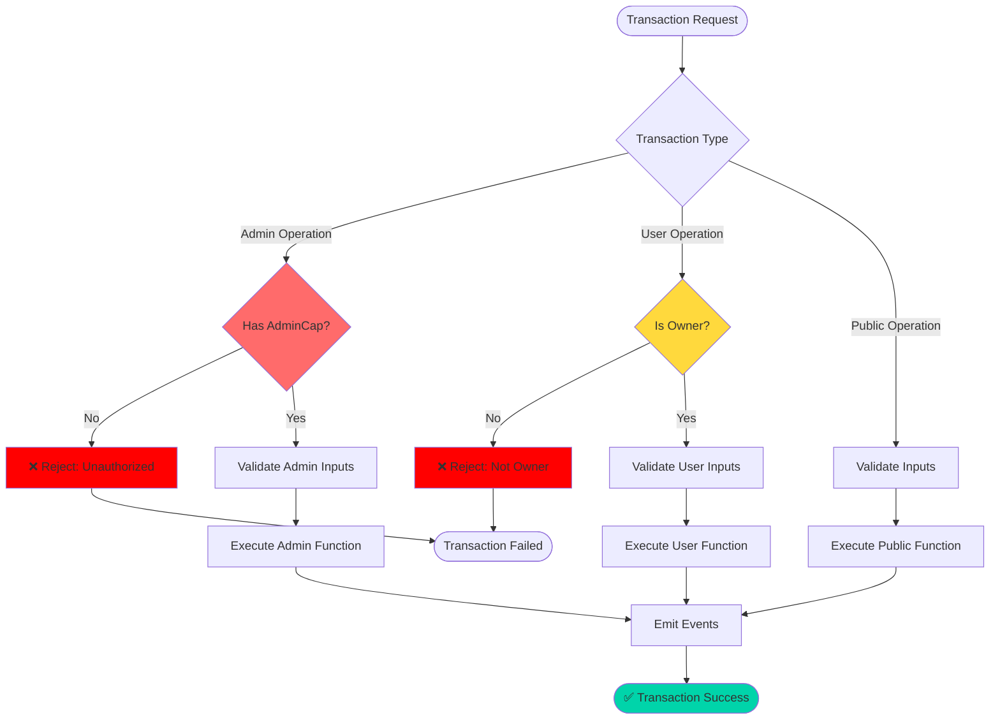
```mermaid
flowchart TD
    Start([Transaction Request]) --> CheckType{Transaction Type}
    
    CheckType -->|Admin Operation| CheckAdminCap{Has AdminCap?}
    CheckType -->|User Operation| CheckOwnership{Is Owner?}
    CheckType -->|Public Operation| ValidateInput[Validate Inputs]
    
    CheckAdminCap -->|No| RejectAdmin[❌ Reject: Unauthorized]
    CheckAdminCap -->|Yes| ValidateAdminInput[Validate Admin Inputs]
    
    CheckOwnership -->|No| RejectOwner[❌ Reject: Not Owner]
    CheckOwnership -->|Yes| ValidateUserInput[Validate User Inputs]
    
    ValidateAdminInput --> ExecuteAdmin[Execute Admin Function]
    ValidateUserInput --> ExecuteUser[Execute User Function]
    ValidateInput --> ExecutePublic[Execute Public Function]
    
    ExecuteAdmin --> EmitEvent[Emit Events]
    ExecuteUser --> EmitEvent
    ExecutePublic --> EmitEvent
    
    EmitEvent --> Success([✅ Transaction Success])
    
    RejectAdmin --> End([Transaction Failed])
    RejectOwner --> End
    
    style CheckAdminCap fill:#FF6B6B
    style CheckOwnership fill:#FFD93D
    style Success fill:#00D4AA
    style RejectAdmin fill:#FF0000
    style RejectOwner fill:#FF0000
```

### Input Validation Flow


```mermaid
flowchart LR
    subgraph "Frontend Validation"
        FV1[Check Required Fields]
        FV2[Validate Data Types]
        FV3[Check Value Ranges]
        FV4[Sanitize Inputs]
    end
    
    subgraph "Smart Contract Validation"
        SV1[Verify Authorization]
        SV2[Check Object States]
        SV3[Validate Business Logic]
        SV4[Check Balances]
    end
    
    subgraph "Blockchain Validation"
        BV1[Verify Signatures]
        BV2[Check Gas]
        BV3[Validate Transaction]
        BV4[Execute & Commit]
    end
    
    FV1 --> FV2 --> FV3 --> FV4
    FV4 --> SV1
    SV1 --> SV2 --> SV3 --> SV4
    SV4 --> BV1
    BV1 --> BV2 --> BV3 --> BV4
    
    style FV4 fill:#4DA2FF
    style SV4 fill:#00D4AA
    style BV4 fill:#FFD93D
```

### Group Susu Validation Rules


```mermaid
graph TD
    subgraph "Create Group Validation"
        CG1[Contribution Amount > 0]
        CG2[Frequency > 0]
        CG3[Max Participants >= 2]
        CG4[Name Not Empty]
    end
    
    subgraph "Join Group Validation"
        JG1[Group Not Full]
        JG2[Not Already Member]
        JG3[Cycle Not Complete]
    end
    
    subgraph "Contribute Validation"
        CO1[Is Participant]
        CO2[Correct Amount]
        CO3[Round Not Complete]
        CO4[Has Sufficient Balance]
    end
    
    subgraph "Distribute Validation"
        DI1[Round Complete]
        DI2[Recipient Is Participant]
        DI3[Recipient Not Paid]
        DI4[Sufficient Group Balance]
    end
    
    CG1 & CG2 & CG3 & CG4 --> CreateSuccess[✅ Create Group]
    JG1 & JG2 & JG3 --> JoinSuccess[✅ Join Group]
    CO1 & CO2 & CO3 & CO4 --> ContributeSuccess[✅ Contribute]
    DI1 & DI2 & DI3 & DI4 --> DistributeSuccess[✅ Distribute]
    
    style CreateSuccess fill:#00D4AA
    style JoinSuccess fill:#00D4AA
    style ContributeSuccess fill:#00D4AA
    style DistributeSuccess fill:#00D4AA
```

### Smart Contract Security
1. **Access Control**: AdminCap for privileged operations
2. **Authorization**: Sender verification in all functions
3. **Ownership**: Objects owned by users, not shared
4. **Validation**: Input validation and error handling
5. **Error Codes**: Comprehensive error constants
6. **Event Emission**: All state changes emit events

### Frontend Security
1. **Wallet Integration**: No private key handling
2. **Transaction Signing**: User approval required
3. **Input Validation**: Client-side validation
4. **Error Handling**: Graceful error recovery
5. **XSS Protection**: Input sanitization
6. **HTTPS Only**: Secure communication

## Walrus Integration

### Storage Architecture

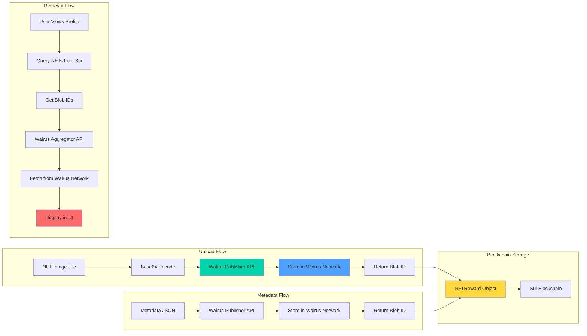
```mermaid
flowchart LR
    subgraph "Upload Flow"
        Image[NFT Image File] --> Encode[Base64 Encode]
        Encode --> Publisher[Walrus Publisher API]
        Publisher --> Store[Store in Walrus Network]
        Store --> BlobID1[Return Blob ID]
    end
    
    subgraph "Metadata Flow"
        JSON[Metadata JSON] --> Publisher2[Walrus Publisher API]
        Publisher2 --> Store2[Store in Walrus Network]
        Store2 --> BlobID2[Return Blob ID]
    end
    
    subgraph "Blockchain Storage"
        BlobID1 --> NFT[NFTReward Object]
        BlobID2 --> NFT
        NFT --> Sui[Sui Blockchain]
    end
    
    subgraph "Retrieval Flow"
        User[User Views Profile] --> Query[Query NFTs from Sui]
        Query --> GetBlobs[Get Blob IDs]
        GetBlobs --> Aggregator[Walrus Aggregator API]
        Aggregator --> Fetch[Fetch from Walrus Network]
        Fetch --> Display[Display in UI]
    end
    
    style Publisher fill:#00D4AA
    style Store fill:#4DA2FF
    style NFT fill:#FFD93D
    style Display fill:#FF6B6B
```

### Walrus API Integration

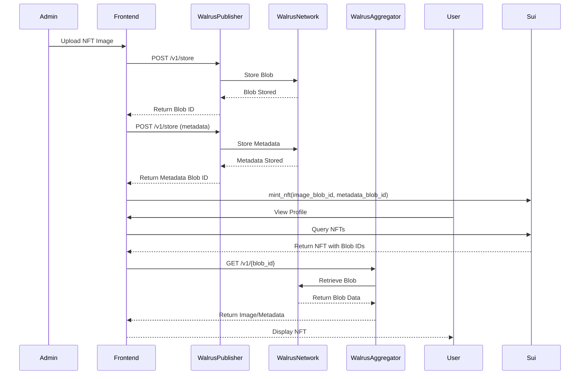
```mermaid
sequenceDiagram
    participant Admin
    participant Frontend
    participant WalrusPublisher
    participant WalrusNetwork
    participant WalrusAggregator
    participant User
    
    Admin->>Frontend: Upload NFT Image
    Frontend->>WalrusPublisher: POST /v1/store
    WalrusPublisher->>WalrusNetwork: Store Blob
    WalrusNetwork-->>WalrusPublisher: Blob Stored
    WalrusPublisher-->>Frontend: Return Blob ID
    
    Frontend->>WalrusPublisher: POST /v1/store (metadata)
    WalrusPublisher->>WalrusNetwork: Store Metadata
    WalrusNetwork-->>WalrusPublisher: Metadata Stored
    WalrusPublisher-->>Frontend: Return Metadata Blob ID
    
    Frontend->>Sui: mint_nft(image_blob_id, metadata_blob_id)
    
    User->>Frontend: View Profile
    Frontend->>Sui: Query NFTs
    Sui-->>Frontend: Return NFT with Blob IDs
    
    Frontend->>WalrusAggregator: GET /v1/{blob_id}
    WalrusAggregator->>WalrusNetwork: Retrieve Blob
    WalrusNetwork-->>WalrusAggregator: Return Blob Data
    WalrusAggregator-->>Frontend: Return Image/Metadata
    Frontend-->>User: Display NFT
```

### API Endpoints
- **Publisher**: `https://publisher.walrus-testnet.walrus.space`
- **Aggregator**: `https://aggregator.walrus-testnet.walrus.space`

### Storage Configuration
- **Epochs**: 5 (configurable)
- **Format**: Binary blob storage
- **Retrieval**: HTTP GET via aggregator
- **Redundancy**: Distributed across Walrus network
- **Availability**: High availability through replication

## Complete User Journey

### End-to-End Flow: From Onboarding to NFT Reward

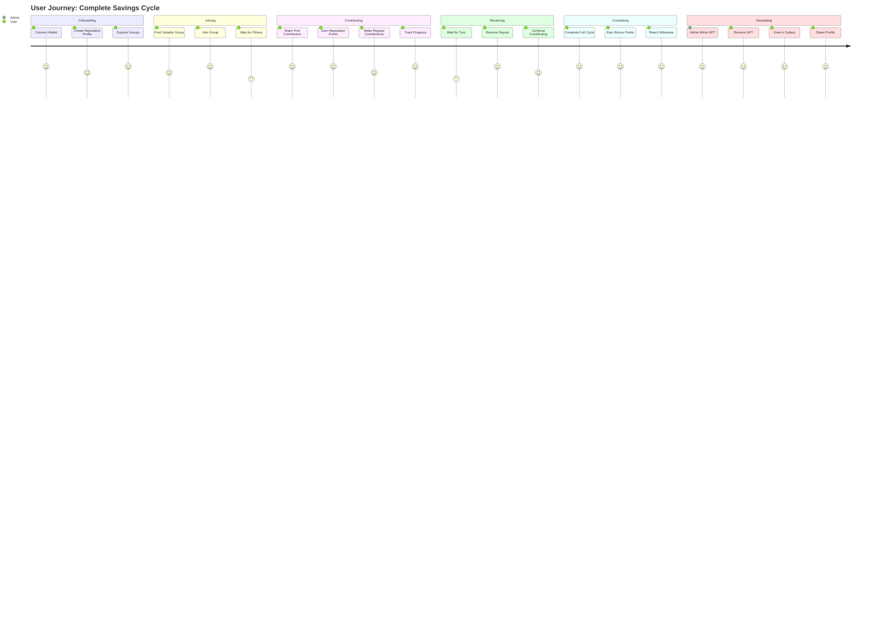
```mermaid
journey
    title User Journey: Complete Savings Cycle
    section Onboarding
      Connect Wallet: 5: User
      Create Reputation Profile: 4: User
      Explore Groups: 5: User
    section Joining
      Find Suitable Group: 4: User
      Join Group: 5: User
      Wait for Others: 3: User
    section Contributing
      Make First Contribution: 5: User
      Earn Reputation Points: 5: User
      Make Regular Contributions: 4: User
      Track Progress: 5: User
    section Receiving
      Wait for Turn: 3: User
      Receive Payout: 5: User
      Continue Contributing: 4: User
    section Completing
      Complete Full Cycle: 5: User
      Earn Bonus Points: 5: User
      Reach Milestone: 5: User
    section Rewarding
      Admin Mints NFT: 5: Admin
      Receive NFT: 5: User
      View in Gallery: 5: User
      Share Profile: 5: User
```

### Complete Transaction Flow

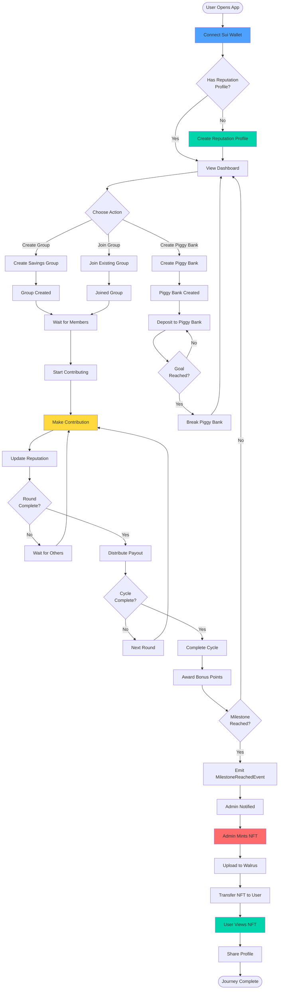
```mermaid
graph TB
    Start([User Opens App]) --> Connect[Connect Sui Wallet]
    Connect --> CheckProfile{Has Reputation<br/>Profile?}
    
    CheckProfile -->|No| CreateProfile[Create Reputation Profile]
    CheckProfile -->|Yes| Dashboard[View Dashboard]
    CreateProfile --> Dashboard
    
    Dashboard --> ChooseAction{Choose Action}
    
    ChooseAction -->|Create Group| CreateGroup[Create Savings Group]
    ChooseAction -->|Join Group| JoinGroup[Join Existing Group]
    ChooseAction -->|Create Piggy Bank| CreatePB[Create Piggy Bank]
    
    CreateGroup --> GroupCreated[Group Created]
    JoinGroup --> GroupJoined[Joined Group]
    CreatePB --> PBCreated[Piggy Bank Created]
    
    GroupCreated --> WaitMembers[Wait for Members]
    GroupJoined --> WaitMembers
    WaitMembers --> StartContributing[Start Contributing]
    
    StartContributing --> Contribute[Make Contribution]
    Contribute --> UpdateRep[Update Reputation]
    UpdateRep --> CheckRound{Round<br/>Complete?}
    
    CheckRound -->|No| WaitMore[Wait for Others]
    WaitMore --> Contribute
    
    CheckRound -->|Yes| Distribute[Distribute Payout]
    Distribute --> CheckCycle{Cycle<br/>Complete?}
    
    CheckCycle -->|No| NextRound[Next Round]
    NextRound --> Contribute
    
    CheckCycle -->|Yes| CompleteCycle[Complete Cycle]
    CompleteCycle --> BonusPoints[Award Bonus Points]
    BonusPoints --> CheckMilestone{Milestone<br/>Reached?}
    
    CheckMilestone -->|No| Dashboard
    CheckMilestone -->|Yes| EmitMilestone[Emit MilestoneReachedEvent]
    
    EmitMilestone --> AdminNotified[Admin Notified]
    AdminNotified --> MintNFT[Admin Mints NFT]
    MintNFT --> UploadWalrus[Upload to Walrus]
    UploadWalrus --> TransferNFT[Transfer NFT to User]
    TransferNFT --> ViewNFT[User Views NFT]
    ViewNFT --> ShareProfile[Share Profile]
    ShareProfile --> End([Journey Complete])
    
    PBCreated --> DepositPB[Deposit to Piggy Bank]
    DepositPB --> CheckGoal{Goal<br/>Reached?}
    CheckGoal -->|No| DepositPB
    CheckGoal -->|Yes| BreakPB[Break Piggy Bank]
    BreakPB --> Dashboard
    
    style Connect fill:#4DA2FF
    style CreateProfile fill:#00D4AA
    style Contribute fill:#FFD93D
    style MintNFT fill:#FF6B6B
    style ViewNFT fill:#00D4AA
```

## Event System

### Event Types & Purposes

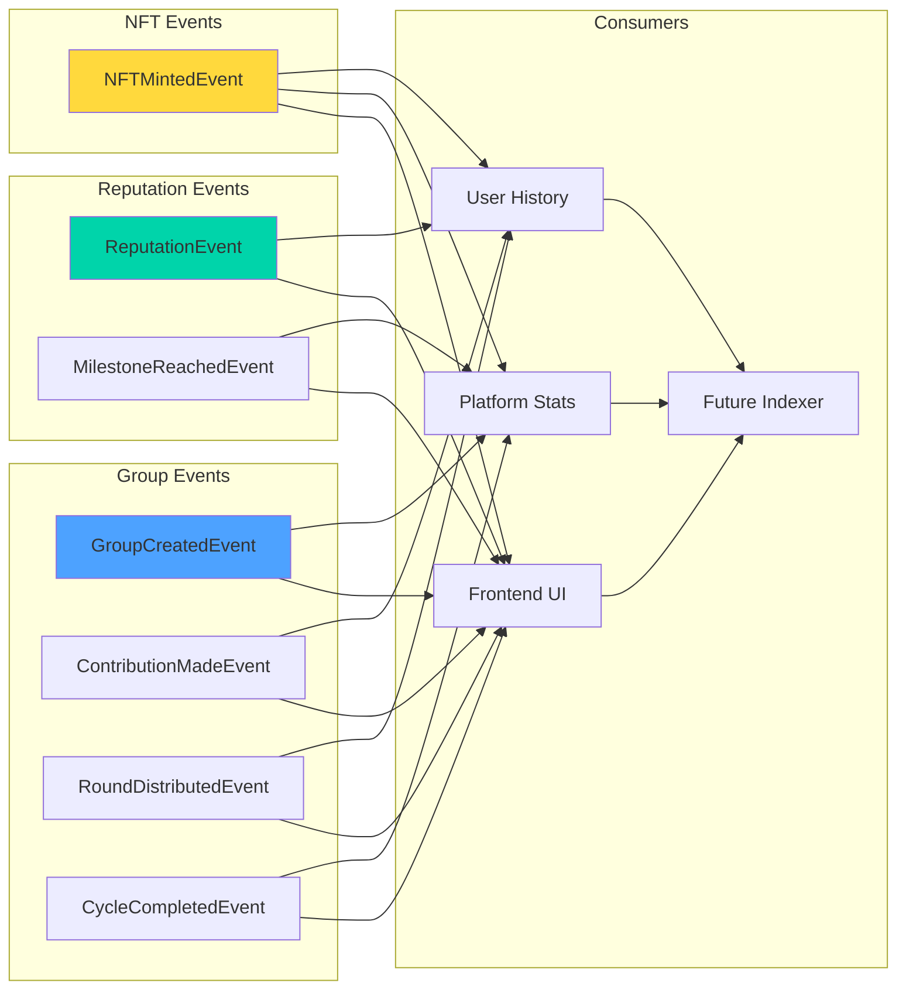
```mermaid
graph LR
    subgraph "Group Events"
        GCE[GroupCreatedEvent]
        CME[ContributionMadeEvent]
        RDE[RoundDistributedEvent]
        CCE[CycleCompletedEvent]
    end
    
    subgraph "Reputation Events"
        RE[ReputationEvent]
        MRE[MilestoneReachedEvent]
    end
    
    subgraph "NFT Events"
        NME[NFTMintedEvent]
    end
    
    subgraph "Consumers"
        Frontend[Frontend UI]
        Stats[Platform Stats]
        History[User History]
        Indexer[Future Indexer]
    end
    
    GCE --> Frontend
    GCE --> Stats
    CME --> Frontend
    CME --> History
    RDE --> Frontend
    RDE --> History
    CCE --> Frontend
    CCE --> Stats
    
    RE --> Frontend
    RE --> History
    MRE --> Frontend
    MRE --> Stats
    
    NME --> Frontend
    NME --> Stats
    NME --> History
    
    Frontend --> Indexer
    Stats --> Indexer
    History --> Indexer
    
    style GCE fill:#4DA2FF
    style RE fill:#00D4AA
    style NME fill:#FFD93D
```

### Event Listeners
- Frontend queries events for history
- Events trigger cache invalidation
- Events used for platform statistics
- Events enable real-time updates
- Events support future indexer integration

## Performance Optimizations

### Frontend
1. **Code Splitting**: Route-based lazy loading
2. **Query Caching**: React Query with optimized stale times
3. **Memoization**: React.memo for expensive components
4. **Debouncing**: Search and filter inputs
5. **Pagination**: Limit query results

### Blockchain
1. **Batch Operations**: Group multiple calls when possible
2. **Event Queries**: Use events instead of object scanning
3. **Shared Objects**: Minimize shared object usage
4. **Gas Optimization**: Efficient Move code

## Scalability Considerations

### Current Limitations
1. **Event Queries**: Limited to 50 events per query
2. **Object Scanning**: No indexer for complex queries
3. **Pagination**: Basic cursor-based pagination

### Future Improvements
1. **Indexer**: Implement custom indexer for complex queries
2. **GraphQL API**: Add GraphQL layer for flexible queries
3. **Caching Layer**: Redis for frequently accessed data
4. **CDN**: Serve static assets via CDN
5. **Load Balancing**: Multiple RPC endpoints

## Deployment Architecture

### Current Testnet Architecture

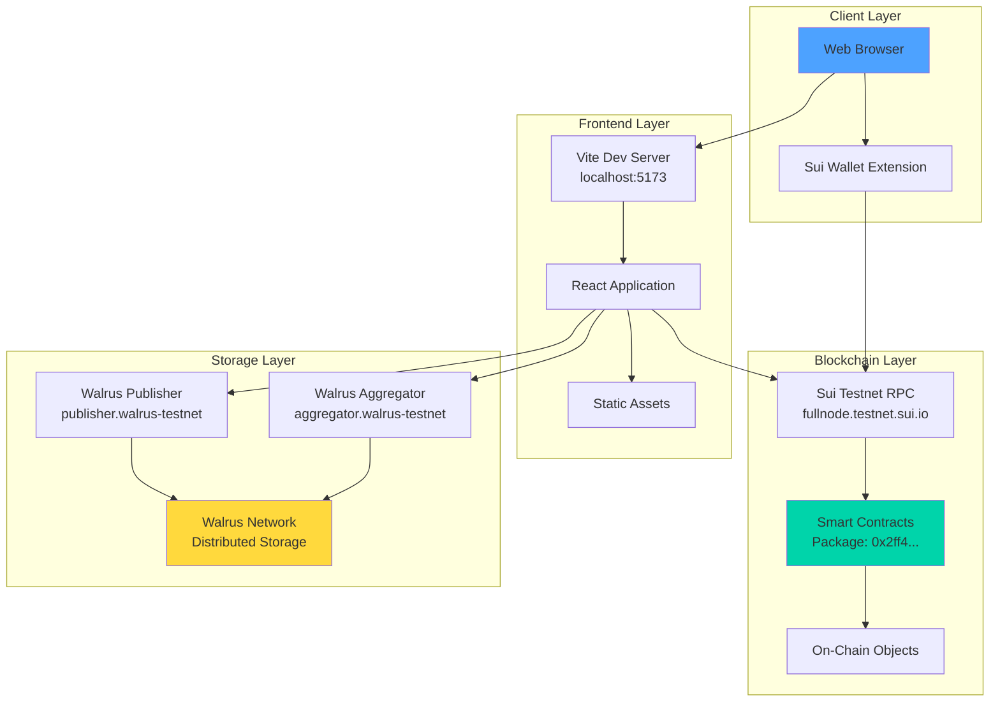
```mermaid
graph TB
    subgraph "Client Layer"
        Browser[Web Browser]
        Wallet[Sui Wallet Extension]
    end
    
    subgraph "Frontend Layer"
        Vite[Vite Dev Server<br/>localhost:5173]
        React[React Application]
        Assets[Static Assets]
    end
    
    subgraph "Blockchain Layer"
        SuiRPC[Sui Testnet RPC<br/>fullnode.testnet.sui.io]
        Contracts[Smart Contracts<br/>Package: 0x2ff4...]
        Objects[On-Chain Objects]
    end
    
    subgraph "Storage Layer"
        WalrusPub[Walrus Publisher<br/>publisher.walrus-testnet]
        WalrusAgg[Walrus Aggregator<br/>aggregator.walrus-testnet]
        WalrusNet[Walrus Network<br/>Distributed Storage]
    end
    
    Browser --> Wallet
    Browser --> Vite
    Vite --> React
    React --> Assets
    
    Wallet --> SuiRPC
    React --> SuiRPC
    React --> WalrusPub
    React --> WalrusAgg
    
    SuiRPC --> Contracts
    Contracts --> Objects
    
    WalrusPub --> WalrusNet
    WalrusAgg --> WalrusNet
    
    style Browser fill:#4DA2FF
    style Contracts fill:#00D4AA
    style WalrusNet fill:#FFD93D
```

### Production Architecture (Future)

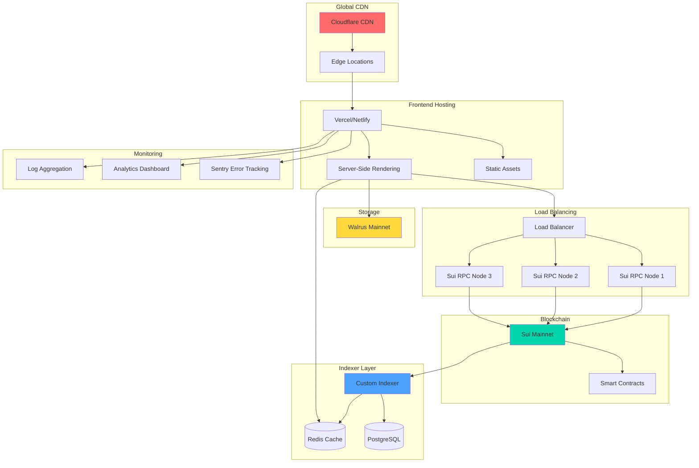
```mermaid
graph TB
    subgraph "Global CDN"
        CF[Cloudflare CDN]
        Edge[Edge Locations]
    end
    
    subgraph "Frontend Hosting"
        Vercel[Vercel/Netlify]
        Static[Static Assets]
        SSR[Server-Side Rendering]
    end
    
    subgraph "Load Balancing"
        LB[Load Balancer]
        RPC1[Sui RPC Node 1]
        RPC2[Sui RPC Node 2]
        RPC3[Sui RPC Node 3]
    end
    
    subgraph "Blockchain"
        Mainnet[Sui Mainnet]
        Contracts[Smart Contracts]
    end
    
    subgraph "Indexer Layer"
        Indexer[Custom Indexer]
        DB[(PostgreSQL)]
        Cache[(Redis Cache)]
    end
    
    subgraph "Storage"
        WalrusMain[Walrus Mainnet]
    end
    
    subgraph "Monitoring"
        Sentry[Sentry Error Tracking]
        Analytics[Analytics Dashboard]
        Logs[Log Aggregation]
    end
    
    CF --> Edge
    Edge --> Vercel
    Vercel --> Static
    Vercel --> SSR
    
    SSR --> LB
    LB --> RPC1
    LB --> RPC2
    LB --> RPC3
    
    RPC1 --> Mainnet
    RPC2 --> Mainnet
    RPC3 --> Mainnet
    
    Mainnet --> Contracts
    Mainnet --> Indexer
    
    Indexer --> DB
    Indexer --> Cache
    
    SSR --> WalrusMain
    SSR --> Cache
    
    Vercel --> Sentry
    Vercel --> Analytics
    Vercel --> Logs
    
    style CF fill:#FF6B6B
    style Mainnet fill:#00D4AA
    style Indexer fill:#4DA2FF
    style WalrusMain fill:#FFD93D
```

### Infrastructure Components

| Component | Testnet | Production |
|-----------|---------|------------|
| **Frontend** | Vite Dev Server | Vercel/Netlify + CDN |
| **RPC** | Public Testnet RPC | Load-balanced Private RPCs |
| **Blockchain** | Sui Testnet | Sui Mainnet |
| **Storage** | Walrus Testnet | Walrus Mainnet |
| **Indexer** | Event Queries | Custom Indexer + PostgreSQL |
| **Cache** | React Query | Redis + React Query |
| **Monitoring** | Console Logs | Sentry + Analytics |
| **SSL** | Dev Certificate | Production SSL |

## Monitoring & Observability

### Metrics to Track
1. **Transaction Success Rate**
2. **Average Gas Costs**
3. **Query Response Times**
4. **Cache Hit Rates**
5. **User Engagement**
6. **Error Rates**

### Logging
- Frontend: Console errors (production: Sentry)
- Smart Contracts: Event emissions
- Transactions: On-chain history

## Testing Strategy

### Smart Contracts
- Unit tests with Move test framework
- Integration tests with Sui CLI
- Manual testing on testnet

### Frontend
- Component testing (future)
- Integration testing (future)
- Manual E2E testing
- Cross-browser testing

---

**Version**: 1.0.0
**Last Updated**: November 21, 2025
